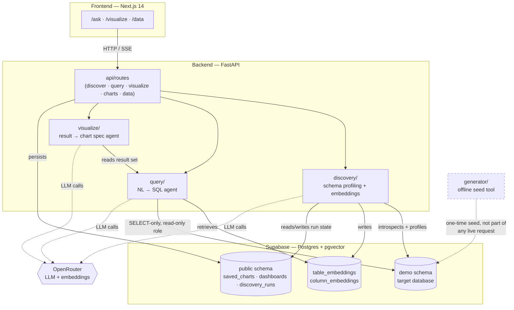
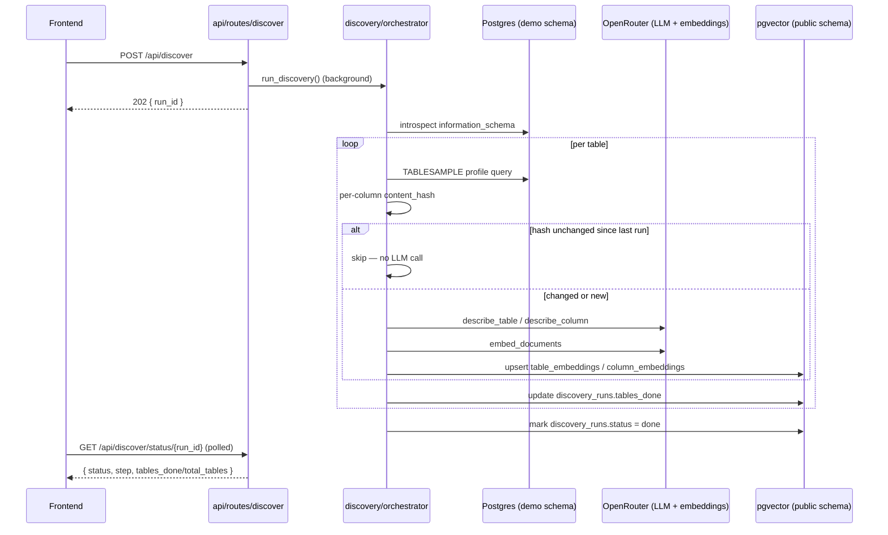
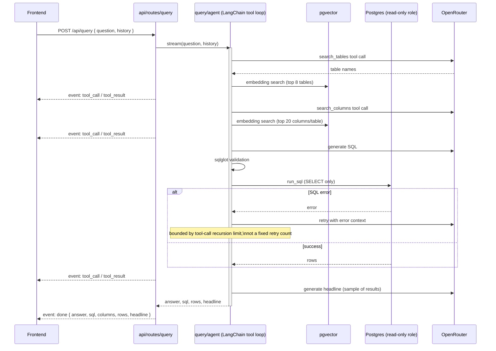
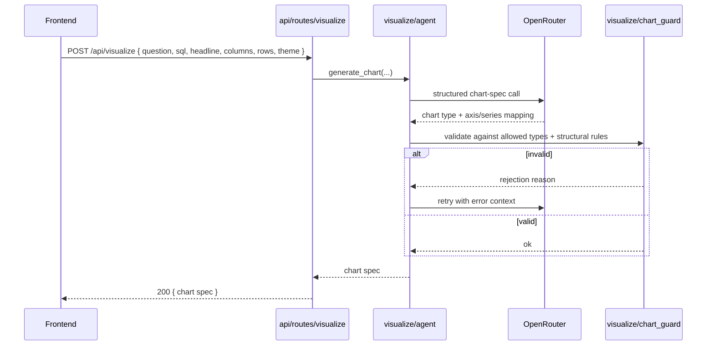

# Table Lens — Architecture

## Status
Canon. Update whenever a component is added, replaced, or its role changes.
Build/rollout progress lives in `docs/PROGRESS.md`, not here.

## System Overview

Three independent agents sit behind one FastAPI service, each owning a
distinct stage of the product: **discovery** turns an unknown database into
searchable, described schema; **query** turns a natural-language question
into validated SQL and a result set; **visualize** turns a result set into
a validated chart spec. None of the three call each other directly — they
communicate only through what they persist (embeddings, results), which
keeps each one independently testable and replaceable.

## Components

### `backend/app/generator/`
Synthetic insurance database generator. Produces 53 tables of realistic fake
data as Parquet, loaded to Supabase via a connector. Deterministic (fixed
seed) — pure function of `config.py` inputs. Not agent logic; run once
offline to seed the demo database, not invoked as part of any live request.
Config split per project-wide convention: real cross-cutting tunables (row
counts, seed, business rates) live in `config.py`; low-impact local
constants stay at the top of the file that uses them.

### `backend/app/discovery/`
Profiles an unknown database once per connection. Sub-components:
- schema introspection (`information_schema` reads)
- statistical profiler (sampled queries via `TABLESAMPLE`)
- relationship inference (name pattern + value-overlap sampling) — computed
  every run and logged, but not currently persisted or consumed by the
  query agent (see `PRD.md`'s Discovery Agent section)
- `llm.py` — LangChain LLM wrapper, routed through OpenRouter (model is a
  config swap, never hardcoded)
- `prompts/` — prompt templates as plain `.md` files (`table_description.md`,
  `column_description.md`), loaded and filled by `llm.py` — kept out of the
  code file so prompt wording can be edited without touching Python
- `embeddings.py` — LangChain embeddings wrapper, routed through OpenRouter
  (same key/base_url as `llm.py`), model `text-embedding-3-small` truncated
  to 768 dimensions, writes to pgvector
- `queries/` — SQL as plain `.sql` files, not inline in Python. Bind
  parameters (`:name`) stay as-is; identifier placeholders (table/column
  names, which SQL can't bind as parameters) use `{name}` and are filled
  via `.format()` before execution

Table/column descriptions and profiles are stored (not recomputed per
query) and consumed by the query agent's retrieval layer. Re-run
optimization is per-column: each column's content hash is checked, and only
changed columns are re-described (a finer-grained mechanism than the
generator's whole-table hash skip — see `PRD.md`).

### `backend/app/query/`
Two-layer retrieval (table embeddings → column embeddings within retrieved
tables) narrows what schema context reaches the LLM prompt — full schema is
never sent. A LangChain tool-calling agent (`search_tables`, `search_columns`,
`run_sql` tools) generates SQL (PostgreSQL 15, SELECT-only, CTEs, LIMIT
enforced), validates it with sqlglot, executes against a read-only DB role,
and on execution failure gets the error fed back so it can retry — bounded
by an overall tool-call recursion limit, not a fixed retry count. Produces a
plain-English headline from actual results via a second LLM call.

### `backend/app/visualize/`
Turns a finished query result into a validated chart spec. A single
structured LLM call (`agent.py`) picks a chart type and axis/series mapping
guided by a prompt (`prompts/`); `chart_guard.py` validates the result
against an allowed chart-type set and structural rules before it reaches the
browser. `theme.py` applies light/dark-aware styling.

### `backend/app/db/`
Supabase/Postgres connection management. Enforces read-only access at the
connection level (dedicated Postgres role), not just via prompt instructions.
Owns pgvector + product-table schema migrations (`migrations/`).

### `backend/app/api/`
FastAPI route layer. Thin — delegates to `discovery/`, `query/`,
`visualize/`, and `db/` (for the `charts`/`data` routes). Five route
modules: `discover`, `query`, `visualize`, `charts`, `data`. Rate limiting
(IP-based, `20/minute` default, `5/hour` on `POST /api/discover`) applied
here.

### `backend/app/utils/`
Backend-wide utilities not specific to one component — currently just
`logger.py`: stdlib `logging`, shared config used by every backend
component (generator, discovery, query, visualize, api). Plain readable
lines (`timestamp | level | module:func | message`) to both stdout and a
rotating file (`backend/logs/app.log`, not committed) — one place to change
format/level rather than per-module `print`/ad-hoc logging calls. No
sensitive data (DB URLs, API keys, raw vectors) ever goes into a log line.
Frontend logging stays console-only (`frontend/lib/logger.ts`) since browser
JS has no filesystem access — there is no frontend equivalent of
`backend/logs/`.

### `frontend/`
Next.js 14, App Router. Three routes: `/ask` (chat paired with the raw
SQL/results view), `/visualize` (a question box paired with accumulating
chart cards), `/data` (raw table browser/overview). SSR chosen over a plain
SPA because dashboards are shareable by link with no auth — server
rendering gives fast first load and real link previews.
`frontend/lib/logger.ts` — thin wrapper over `console.*` with levels,
dev/prod aware. No external logging service — matches no-auth showcase
scope.

## Data Flow

### Discovery: `POST /api/discover` → run status

Relationship inference runs alongside the per-table loop (name-pattern +
value-overlap sampling) but its output is only logged today — not yet
persisted to `discovery_runs` or read back by the query agent.

### Query: `POST /api/query` (SSE)

### Visualize: `POST /api/visualize`

## Data Stores
- **Postgres (Supabase):** the demo insurance database itself (generator
  output, in the `demo` schema), plus product tables in `public`
  (`saved_charts`, `dashboards`, `discovery_runs`).
- **pgvector:** `table_embeddings`, `column_embeddings` — discovery agent
  output, consumed by the query agent's retrieval layer.

## Cross-Cutting Decisions
- **LangChain everywhere an LLM is called** — no direct provider SDK usage,
  so the model is a config swap, not a code change.
- **Read-only enforcement is structural**, not just instructional — a
  read-only DB role backs every SELECT-only rule in the system prompt.
- **No auth** — single shared showcase instance, rate limiting is the only
  access control.
